## Blog - ASP.Net Core
Web-project based on ASP.Net Core 3.0.  
Used Bootstrap theme - [Bootswatch/LUX](https://bootswatch.com/lux/)

#### Requirements:
   - ASP.Net Core 3.0
   - Microsoft SQL Server
   - Entity Framework Core
   - Bootstrap 4

#### How to set up a database  
   - Download MS SQL Server backup files - [download](https://github.com/leodeg/CSharp.Blog/releases/download/version-0.1-alpha/BlogDB.bak)
   - Restore the database from backup file at SQL Server Management Studio
   - Load project

#### How to run the application
  - Clone/Download the project - [download](https://github.com/leodeg/CSharp.Blog/archive/master.zip)
  - Open the project from your IDE
  - Run application

## Screenshots
### User
#### Blog Page
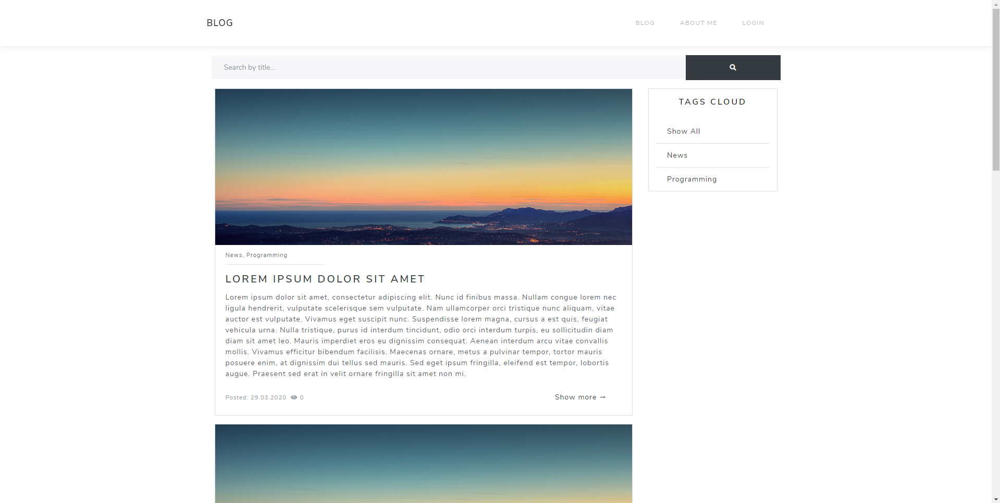
#### About me Page
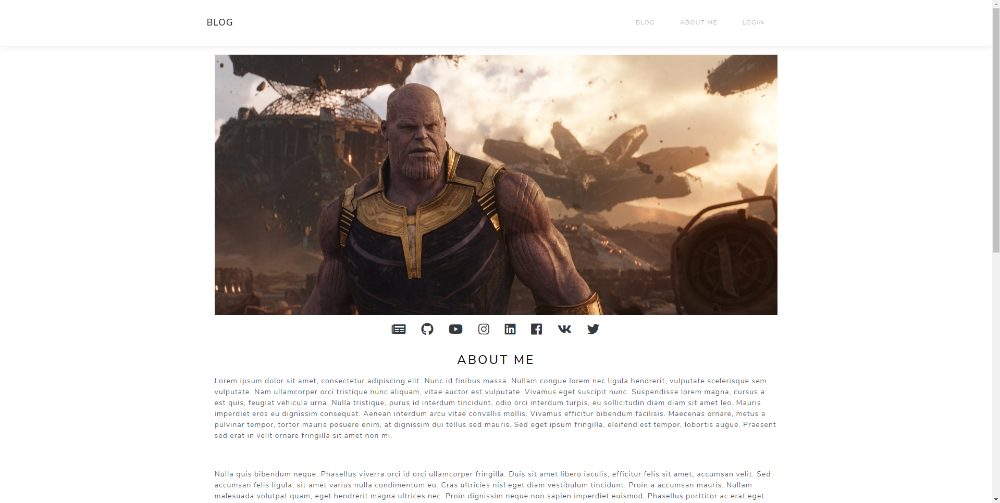
#### Post Page
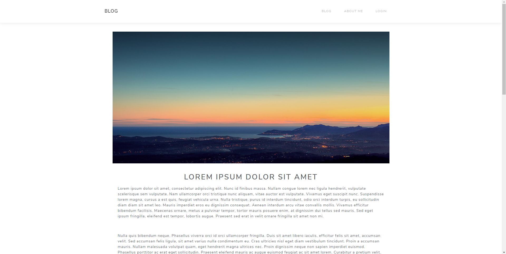
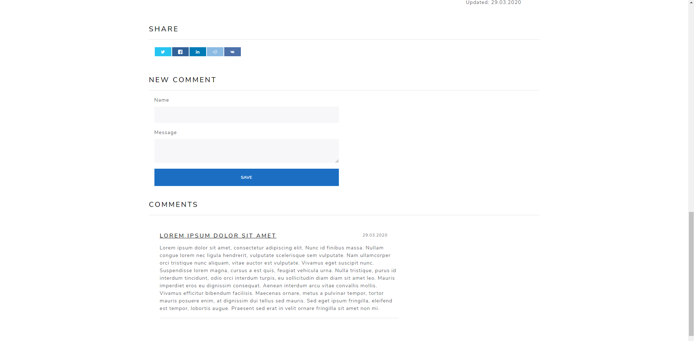

### Admin Pages
#### Posts Admin Page
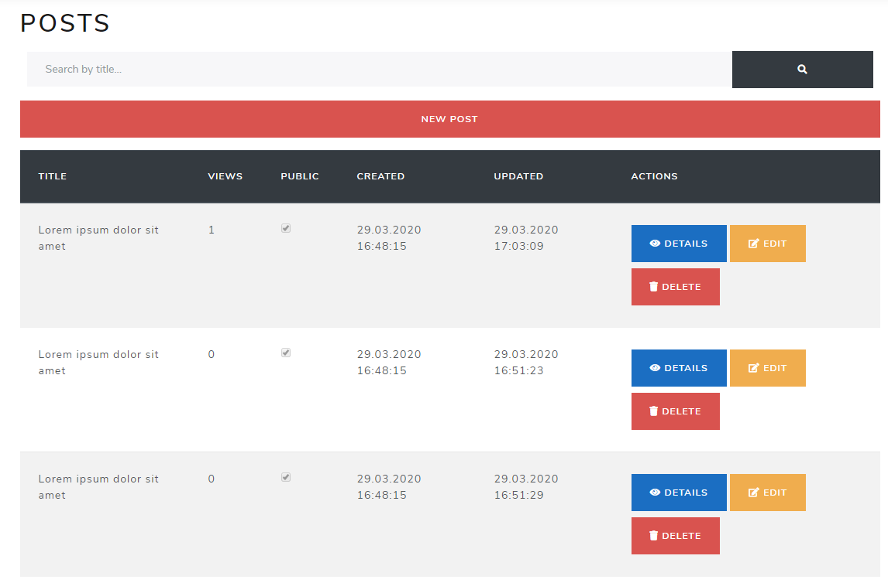
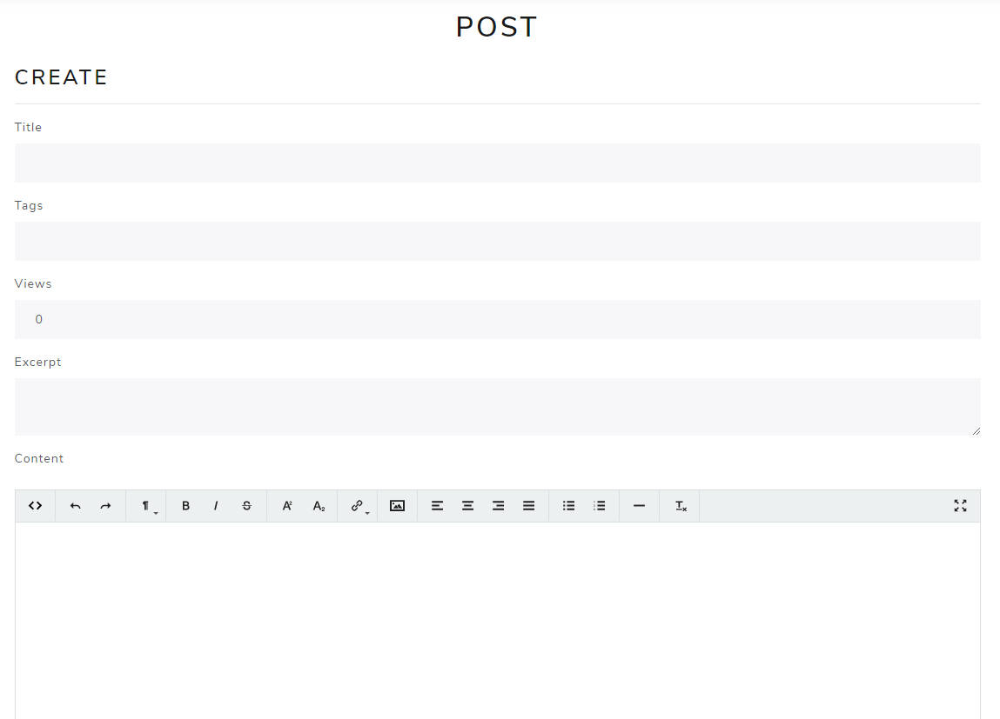
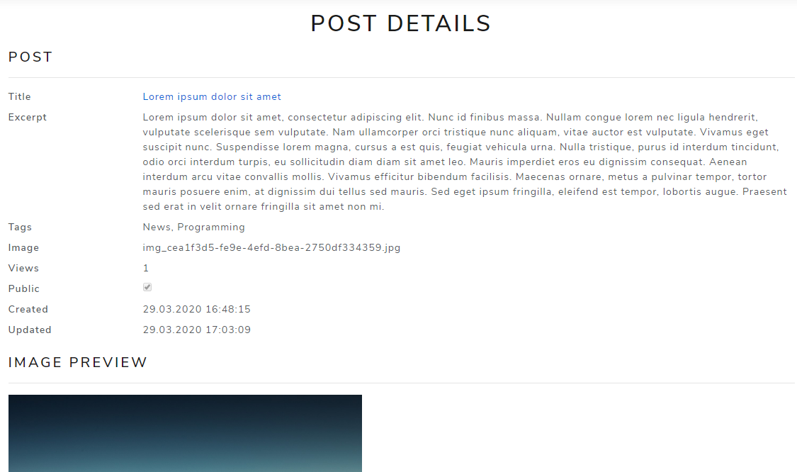
#### Tags Admin Page
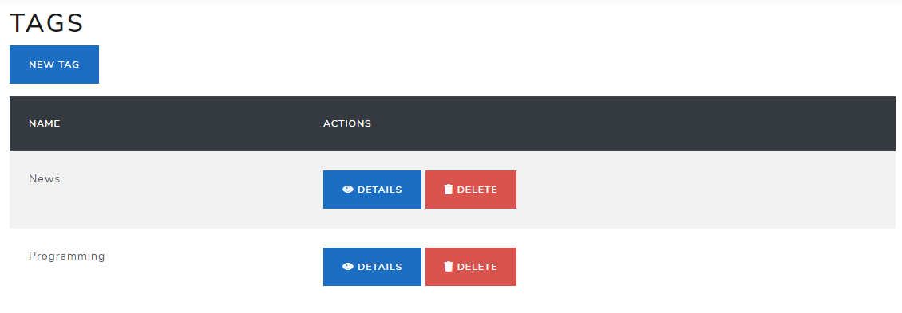
#### Comments Admin Page
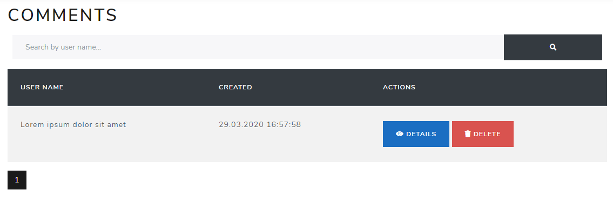
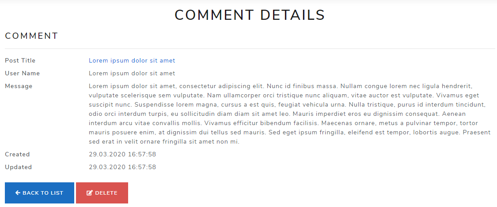
#### User Manager Admin Page
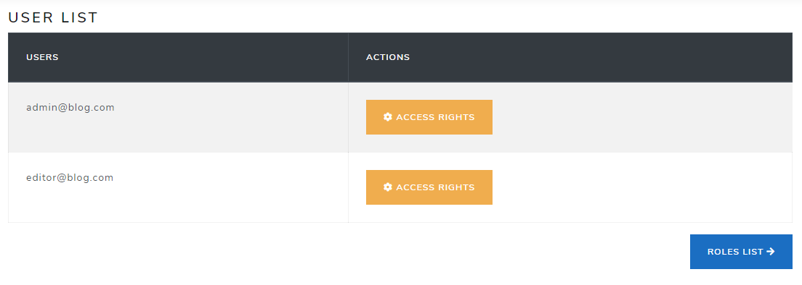
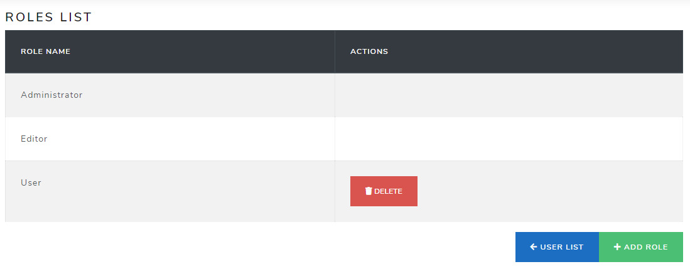
